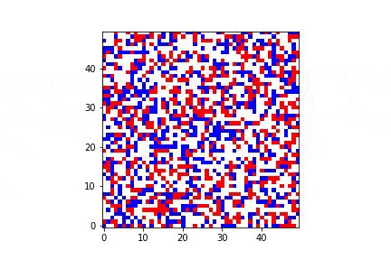

# Schelling's Segregation Model

Schelling's model of segregation is an agent-based model developed by economist Thomas Schelling. This model demonstrates that even with "mild" in-group preferences, a highly segregated society can emerge through de facto segregation. It does not account for external pressures like laws or policies (e.g., Jim Crow laws in the United States) but highlights how individual preferences can lead to significant societal patterns. [(Wikipedia)](https://en.wikipedia.org/wiki/Schelling%27s_model_of_segregation)

